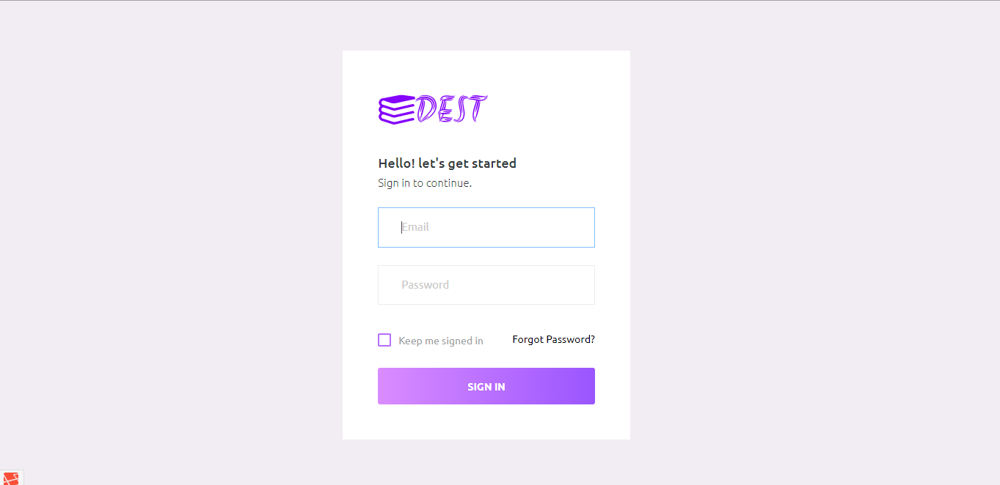
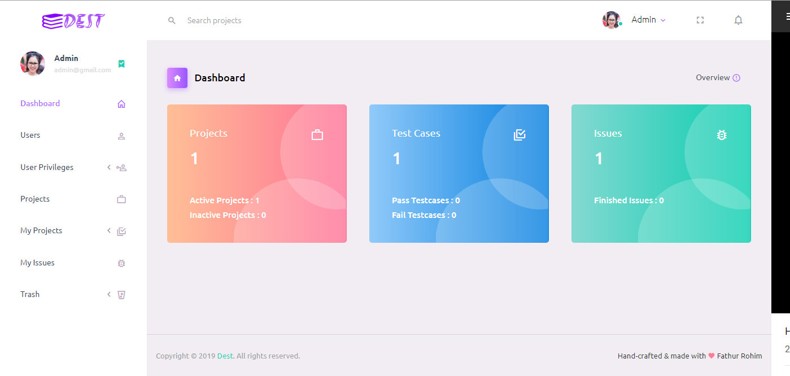
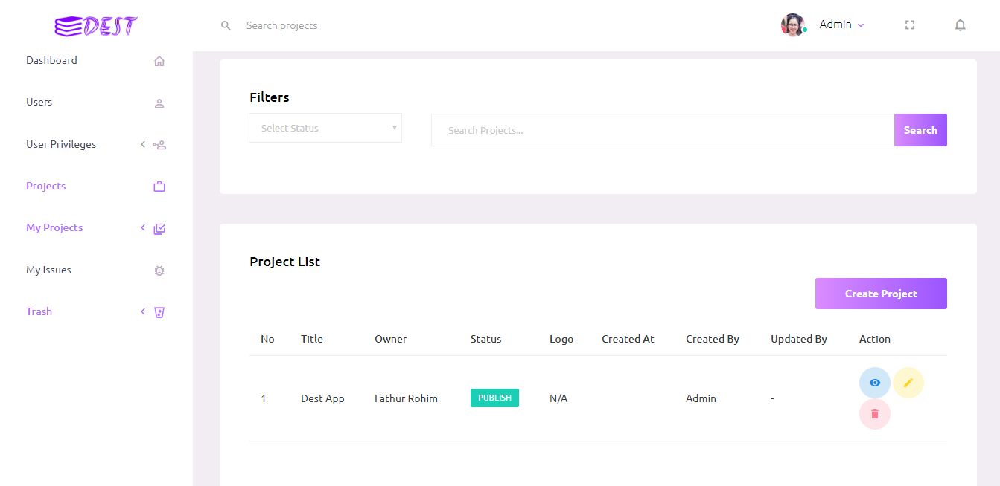
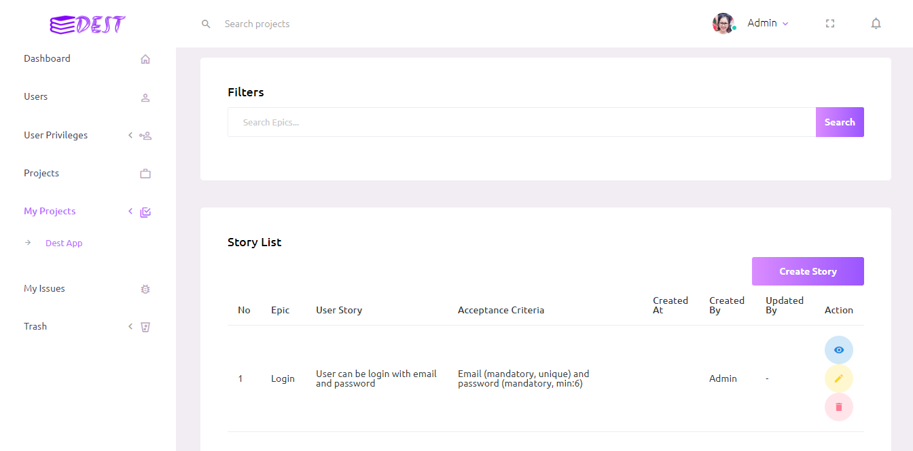
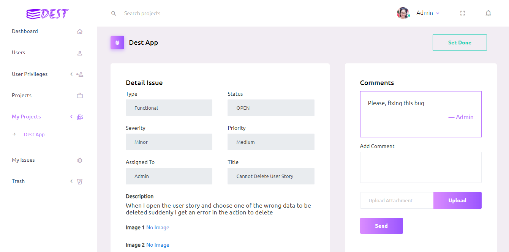

<p align="center"></p>

## About Dest
* Management Projects for QA (Quality Assurance) and Team (Developer, Project Manager)
* Tracking Project by User Stories

## Screenshot
* Login :
   
   
* Dashboard
   
   
* List Projects
   
   
* List Stories
   
  
* Comments Issue
   

## Credits
- [Purple Admin](https://github.com/BootstrapDash/PurpleAdmin-Free-Admin-Template "Purple Admin")
- [Laravel 5.8](https://laravel.com/docs/5.8 "Laravel 5.8")

## Contribute
You can read this article : [Fork a Repo](https://help.github.com/en/articles/fork-a-repo "Fork a Repo")

## Next
- Clone the repo of dest : `git clone https://github.com/oimtrust/dest.git`
- Copy .env.example to .env : `sudo cp .env.example .env`
- Set your database in .env file :
  ```
  DB_DATABASE=your_db
  DB_USERNAME=your_username
  DB_PASSWORD=your_password_of_db
  ```
- Run the command `composer install` to install all the dependencies
- Run the command `php artisan key:generate` to generate the new key
- Run the command `php artisan migrate:fresh --seed`
- Run the command `php artisan storage:link`
- Run the command `php artisan serve`. This will open Dest app in your browser
- Make your valuable contribution
- Submit a pull request.

## License
The Dest App is open-source software licensed under the [MIT license](https://opensource.org/licenses/MIT).
